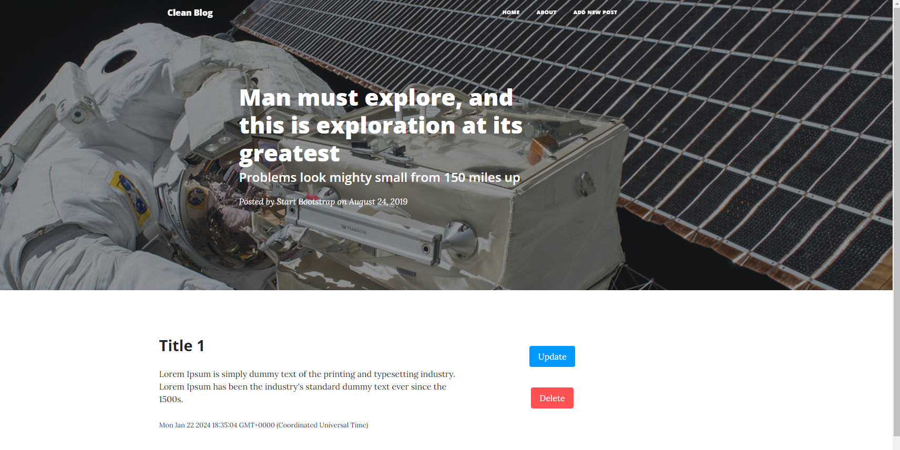

# CLEAN BLOG

**LIVE DEMO:** [CLEAN-BLOG]()

Clean Blog is a web application developed with nodejs. You can add your posts with a title and a description. You can also display, edit and delete the post you have already added.

---

## Installation

In the project directory, you should run the commands below:

#### `npm install`

#### `npm start`

Also make sure to connect your own database before you start the app. DB connection is located in the app.js folder.

---

# Project Preview

#### Index Page

You can display the posts you have added here. Each post is clickable and when you click on one of them, it is going to lead you to its edit page.

#### Add Post Page

You can add a new post on this page.

#### Edit Page

You can edit or delete the post you added by clicking on the relevant post.

---

## Used technologies

- HTML
- CSS
- JAVASCRIPT
- NODEJS
- MONGODB
- MONGOOSE
- EXPRESSJS
- NODEMON
- MIDDLEWARES
- TEMPLATE ENGINE
- DEPLOYMENT (RENDER)
- MVC

---
